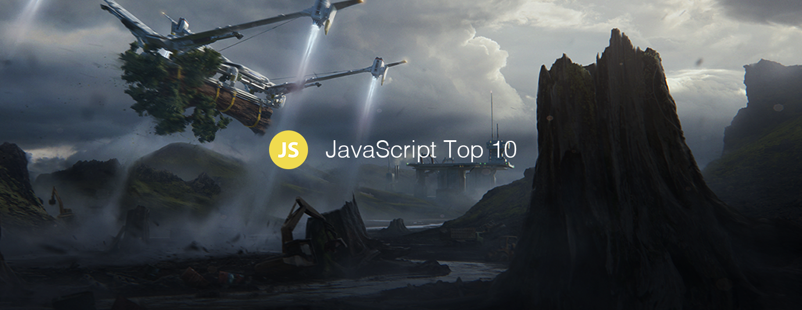

# JavaScript Top 10 Articles for the Past Month (v.Nov 2018)

</a>

For the past month, we ranked nearly 1,200 JavaScript articles to pick the Top 10 stories that can help advance your career (0.8% chance).

* Topics in this list: JavaScript Handbook, TensorFlow.js, WebAssembly, JavaScript’s Prototype, State of the Web, Python, Adaptive Serving, Design Patterns, Functional Programming, Experts
* Also published on the [publication](https://goo.gl/cEG383)

 

### Course of the month:

[A) Beginners: JavaScript: Understanding the Weird Parts.](http://bit.ly/2PVyxi6) [28,056 recommends, 4.7/5 stars]

[B) ES6 Javascript: The Complete Developer’s Guide.](http://bit.ly/2OrEkKz) [6,263 recommends, 4.6/5 stars]

 

## Rank 1
### [The Complete JavaScript Handbook](https://medium.freecodecamp.org/the-complete-javascript-handbook-f26b2c71719c?utm_source=mybridge&utm_medium=blog&utm_campaign=read_more)

 

## Rank 2
### [Playing Mortal Kombat with TensorFlow.js. Transfer learning and data augmentation](https://blog.mgechev.com/2018/10/20/transfer-learning-tensorflow-js-data-augmentation-mobile-net?utm_source=mybridge&utm_medium=blog&utm_campaign=read_more)

 

## Rank 3
### [Calls between JavaScript and WebAssembly are finally fast ](https://hacks.mozilla.org/2018/10/calls-between-javascript-and-webassembly-are-finally-fast-%F0%9F%8E%89?utm_source=mybridge&utm_medium=blog&utm_campaign=read_more)

 

## Rank 4
### [A Beginner's Guide to JavaScript's Prototype](https://tylermcginnis.com/beginners-guide-to-javascript-prototype?utm_source=mybridge&utm_medium=blog&utm_campaign=read_more)

 

## Rank 5
### [The State of JavaScript - The State of the Web](https://www.youtube.com/watch?v=i5R7giitymk?utm_source=mybridge&utm_medium=blog&utm_campaign=read_more)

 

## Rank 6
### [Watch me build a real startup with Python and JavaScript | Web Development | Build A Startup #1](https://www.youtube.com/watch?v=UyQn0BhVqNU?utm_source=mybridge&utm_medium=blog&utm_campaign=read_more)

 

## Rank 7
### [Adaptive Serving using JavaScript and the Network Information API](https://dev.to/addyosmani/adaptive-serving-using-javascript-and-the-network-information-api-331p?utm_source=mybridge&utm_medium=blog&utm_campaign=read_more)

 

## Rank 8
### [Understanding Design Patterns in JavaScript](https://blog.bitsrc.io/understanding-design-patterns-in-javascript-13345223f2dd?utm_source=mybridge&utm_medium=blog&utm_campaign=read_more)

 

## Rank 9
### [Fear, trust and JavaScript: When types and functional programming fail](https://www.reaktor.com/blog/fear-trust-and-javascript?utm_source=mybridge&utm_medium=blog&utm_campaign=read_more)

 

## Rank 10
### [Conditional JavaScript for Experts: Mastery of conditional expressions for cleaner codes](https://hackernoon.com/conditional-javascript-for-experts-d2aa456ef67c?utm_source=mybridge&utm_medium=blog&utm_campaign=read_more)

                    
