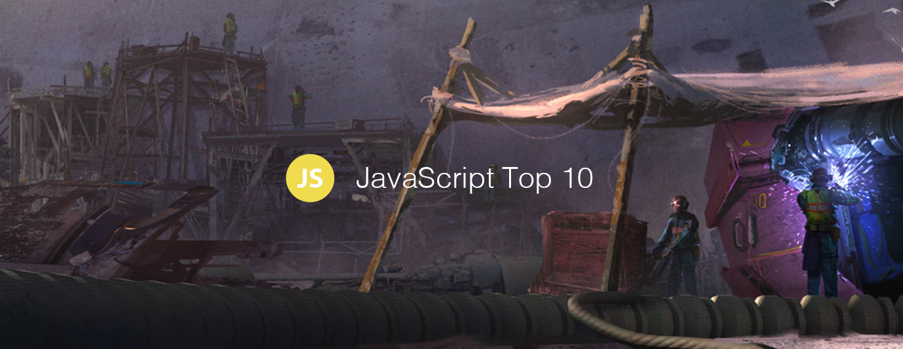

# JavaScript Top 10 Articles for the Past Month (v.Dec 2018)

</a>

For the past month, we ranked nearly 1,200 JavaScript articles to pick the Top 10 stories that can help advance your career (0.8% chance).

* Also published on the [publication](https://goo.gl/WTss2Z)

 

### Course of the month:

[A) Beginners: The Complete JavaScript Course 2018: Build Real Projects!](http://bit.ly/2m4j6qE) [30,515 recommends, 4.6/5 stars]

[B) Accelerated ES6 JavaScript Training: Learn and Use the Future of JavaScript — today](http://bit.ly/2SxqubU) [2,412 recommends, 4.7/5 stars]

 

## Rank 1
### [Understanding Asynchronous JavaScript: Learn How JavaScript Works](https://blog.bitsrc.io/understanding-asynchronous-javascript-the-event-loop-74cd408419ff?utm_source=mybridge&utm_medium=blog&utm_campaign=read_more)

 

## Rank 2
### [Experimenting with brain-computer interfaces in JavaScript.](https://medium.com/@devdevcharlie/experimenting-with-brain-computer-interfaces-in-javascript-8d6cb891fda8?utm_source=mybridge&utm_medium=blog&utm_campaign=read_more)

 

## Rank 3
### [Beyond console.log(): There is more to debugging JavaScript than console.log to output values](https://medium.com/@mattburgess/beyond-console-log-2400fdf4a9d8?utm_source=mybridge&utm_medium=blog&utm_campaign=read_more)

 

## Rank 4
### [Functional Programming Principles in Javascript](https://dev.to/leandrotk_/functional-programming-principles-in-javascript-26g7?utm_source=mybridge&utm_medium=blog&utm_campaign=read_more)

 

## Rank 5
### [Complex JS-heavy Web Apps, Avoiding the Slow (Chrome Dev Summit 2018)](https://www.youtube.com/watch?v=ipNW6lJHVEs?utm_source=mybridge&utm_medium=blog&utm_campaign=read_more)

 

## Rank 6
### [Handling Errors in JavaScript: The Definitive Guide](https://levelup.gitconnected.com/the-definite-guide-to-handling-errors-gracefully-in-javascript-58424d9c60e6?utm_source=mybridge&utm_medium=blog&utm_campaign=read_more)

 

## Rank 7
### [Front-end JavaScript Interviews in 2018–19](https://blog.webf.zone/front-end-javascript-interviews-in-2018-19-e17b0b10514?utm_source=mybridge&utm_medium=blog&utm_campaign=read_more)

 

## Rank 8
### [As a JS Developer, This Is What Keeps Me Up at Night](https://www.toptal.com/javascript/es6-class-chaos-keeps-js-developer-up?utm_source=mybridge&utm_medium=blog&utm_campaign=read_more)

 

## Rank 9
### [JavaScript async patterns quick guide](https://www.imaginarycloud.com/blog/asynch-javascript-patterns-guide?utm_source=mybridge&utm_medium=blog&utm_campaign=read_more)

 

## Rank 10
### [Little known features of JavaScript](https://blog.usejournal.com/little-known-features-of-javascript-901665291387?utm_source=mybridge&utm_medium=blog&utm_campaign=read_more)

                    
